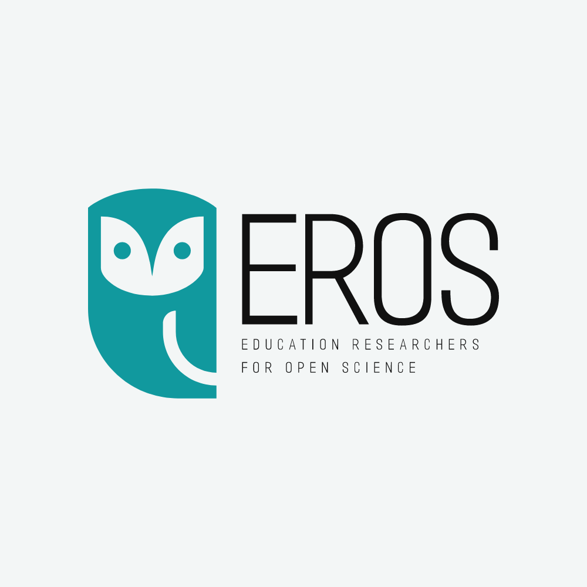

```{r opts, echo = FALSE}
#suppress the warnings and other messages from showing in the knitted file.
knitr::opts_chunk$set(
  fig.width  = 8,  
  fig.height = 5, 
  fig.path   = 'images/04/',
  echo       = TRUE, 
  warning    = FALSE, 
  message    = FALSE,
  cache      = TRUE
)
```
Materials for Session 3 in Week 8 can be found [here](./03DigitalTools.pdf)


➔	Why share data? Ethics, legality  & FAIR principles 

➔	Learn about FAIR data principles 

◆ Ensure data is human & machine readable
◆ Create meta-data
◆ Identify relevant repositories
◆ Assign a DOI & license 

➔ Learn about ethical & legal issues


FOLLOW-UP: Identify other discipline appropriate data repositories for your project.  
{width="30%"} **For more info, contact: [cylcia.bolibaugh\@york.ac.uk](mailto:cylcia.bolibaugh@york.ac.uk){.email}**


